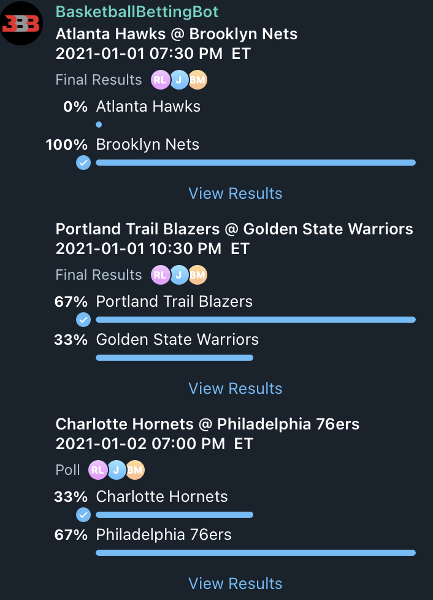
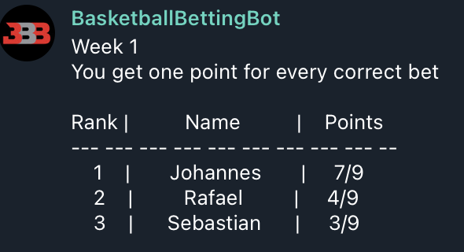

# Basketball Betting Bot - Another Ball Brother

**TELEGRAM: @BasketballBettingBot**

The fourth Ball Brother didn't make it to the *NBA* and slipped off into sports
gambling and wants to play with you! He sends you 11 NBA games to bet on each week,
10 good ones and one battle between the supreme tank commanders.
The one who gets the most games right in a week gets one point.

You play against the other members of your group chat and the overall winner is
the one with the most points at the end of the season.
There's also an alternative ranking that's just looking at the total number of
bets you guys got right, and doesn't care about weekly wins if that's more
your style.

To get started add the bot (@BasketballBettingBot) to your group chat and 
send /start into the chat. Afterward you'll receive the games to bet on 
for the upcoming week. Each game is sent to you in the form of a poll, 
so just answer these to participate in the game. 
After sending /start for the first time, all you need to do is answer the polls
that will be sent to you weekly.
This continues until the NBA season ends or you end the season yourself (/stop_season).
The bot can't read your group chat's messages, just the ones starting with an '/',
so don't worry about trash talking him - he won't know. 

**These are the commands he understands:**

- **/start** -> Start your season! (wait until everyone who wants to participate was
added to the group)

- **/standings** -> Show standings for the ongoing week

- **/full_standings** -> Show standings for the whole season

- **/all_bets** -> Show fraction of correct bets for the whole season
(Alternative to weekly standings)

- **/week_standings** -> Show standings for a specified week

- **/sage** -> Cleanse the chat from toxic energy

- **/stop_season** -> End the betting season and receive final standings.
THIS CAN'T BE UNDONE!

Here's an example of what it looks like:

